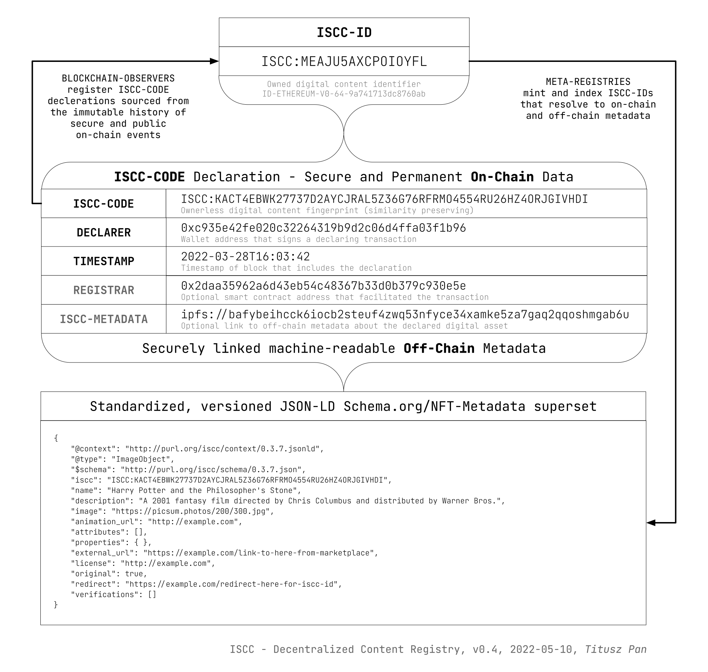

# ISCC - Decentralized Content Registry

[](https://github.com/iscc/iscc-registry/actions/workflows/tests.yml)

## About `iscc-registry`

`iscc-registry` is a web application for running a decentralized, cross-chain, content
registry (also called Meta-Registry) based on the declaration protocol of the
**International Standard Content Code** ([ISCC](https://iscc.codes)).

An ISCC-CODE is an open-source, content-based identifier and fingerprint for digital media assets.
By declaring ISCC-CODEs on public blockchains users can obtain a short and globally unique ISCC-ID
which associates the ISCC-CODE with their blockchain wallet address/identity.



Public [ISCC-CODE declarations](https://github.com/iscc/iscc-evm) from different blockchains are
monitored by [ISCC-OBSERVERs](https://github.com/iscc/iscc-observer-evm) and registered with an
`iscc-registry` via its REST Api. The `iscc-registry` calculates and indexes ISCC-IDs based on the
events received from observers. The resulting ISCC-IDs are identifiers for digital media assets
with the following mandatory information attached:

- An ISCC-CODE, which is a content-based identifier and fingerprint of a media assset
- A DECLARER, which is the blockchain address of entity that signed a declaration transaction
- A timestamp of the declaration

An ISCC declaraton can optionally provide

- A URL with extended [metdadata](https://schema.iscc.codes) about the digital media asset
- A redirection target that can be used like a URL-shortener (e.g. `https://iscc-reg.tld/<iscc-id>`)
- The blockchain address of a registrar that facilitated the declaration

## Develoment Setup

**Requirements:**

- [Python](https://www.python.org/) 3.8 - 3.10
- [Poetry](https://python-poetry.org/)

Get up and running:
```shell
git clone https://github.com/iscc/iscc-registry.git
cd iscc-registry
poetry install
poe demo
python manage.py runserver
```

